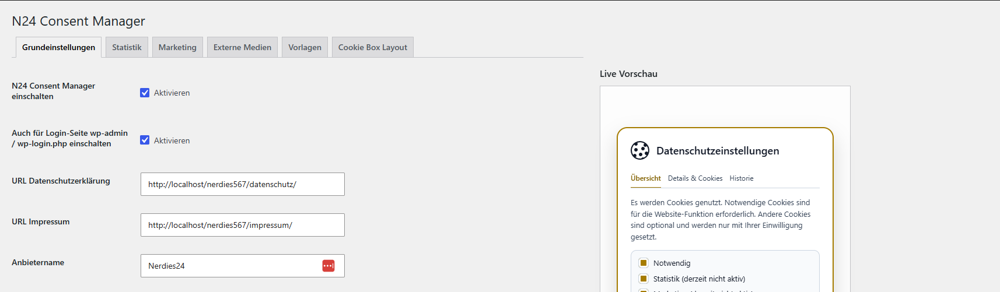
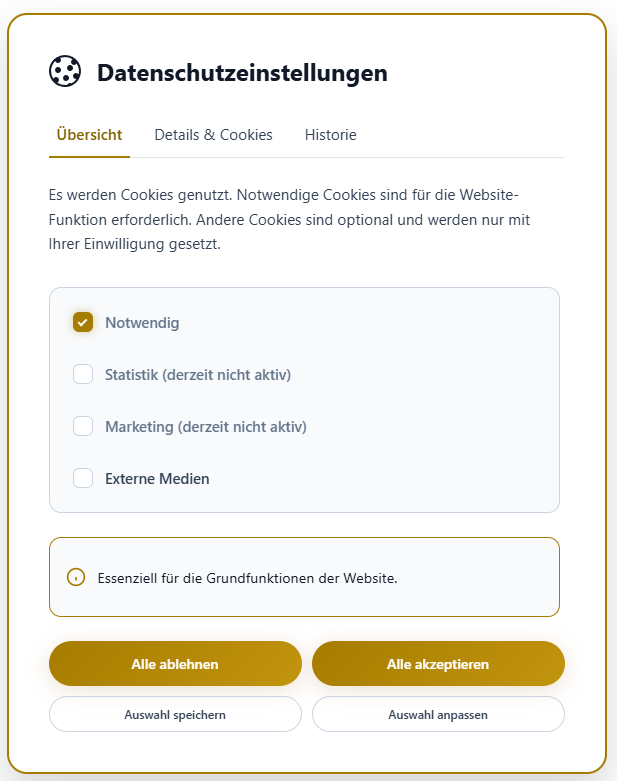

# N24 Consent Manager

WordPress-Plugin für das Consent-Tool der bestehenden Website.

## Screenshots

### Backend mit Live Vorschau



### Cookie-Banner im Frontend



## Installation

1. Den Ordner `n24-consent-manager` nach `wp-content/plugins/` kopieren oder die ZIP-Datei in WordPress hochladen.
2. Im WordPress-Adminbereich unter `Plugins` aktivieren.
3. Unter `Einstellungen > N24 Consent Manager` URLs, Farben, Icon und Texte prüfen.

## Backend

Die Einstellungsseite ist in Tabs gegliedert. Farbfelder verwenden den WordPress-Colorpicker, rechts wird eine Live-Vorschau der Cookie-Box angezeigt.

## Sprache

Die Standardsprache des Plugins ist Deutsch. Eine englische Sprachdatei liegt unter `languages/n24-consent-manager-en_US.po` und `languages/n24-consent-manager-en_US.mo`.

## Schriftart

Das Plugin setzt keine eigene Schriftfamilie. Banner, Buttons und Tabs erben die Schriftart des aktiven Themes.

## Cookie-Einstellungen-Link

Der Floating-Button wird automatisch ausgegeben. Für einen zusätzlichen Link im Footer oder in Seiten kann dieser Shortcode genutzt werden:

```text
[n24_consent_settings]
```

Die alten Shortcodes `[conset_cookie_settings]` und `[conny_cookie_settings]` bleiben als Aliase erhalten.

## Verhalten ohne optionale Dienste

Sind keine Statistik-, Marketing- oder externen Mediendienste aktiv, arbeitet das Plugin seit Version 1.8.48 im Nur-notwendig-Modus:

- kein automatischer Banner beim Erstbesuch;
- kein Consent-Cookie und kein Local-Storage-Eintrag;
- keine Consent-ID, keine Einwilligungshistorie und keine neuen Serverprotokolle;
- kein Historienreiter und keine Auswahl- oder Details-Schaltfläche neben den vorhandenen Tabs;
- der Footer-Link und der Floating-Button öffnen ausschließlich die „Cookie-Informationen“;
- ein bereits als „Cookie-Einstellungen“ gespeicherter Footerlink wird im Nur-notwendig-Modus gezielt als „Cookie-Informationen“ beschriftet und angebunden, ohne das Footer-Element neu zu speichern;
- beim ersten Laden nach dem Update werden der frühere Browser-Speichereintrag und das frühere Consent-Cookie entfernt.

Sobald mindestens ein optionaler Dienst tatsächlich verfügbar ist, wechselt das Plugin automatisch zurück in den vollständigen Consent-Modus mit Banner, Auswahl, Speicherung und Protokollierung. Frühere serverseitige Protokolle werden durch die bestehende technische Aufbewahrungsgrenze automatisch bereinigt.

## Seiteninhalte und Anbietername ab Version 1.8.52

Das Plugin legt keine Datenschutzseite an und ändert oder löscht keine Inhalte bestehender Seiten. Die konfigurierte Datenschutz-URL wird ausschließlich als Link im Consent-Dialog verwendet. Der Text aus `DATENSCHUTZ-BAUSTEIN.md` ist nur eine manuelle Arbeitshilfe und wird nicht automatisch eingefügt.

Frühere Versionen 1.8.49 und 1.8.50 enthielten eine Migration für den Inhalt einer vorhandenen Datenschutzseite. Diese Migration ist ab Version 1.8.52 vollständig entfernt. Bereits durch eine frühere Version eingefügte Inhalte werden nicht automatisch zurückgesetzt, weil auch das ein erneuter Eingriff in die Seite wäre.

Bekannte ältere InstantVOLT-Anbieterbezeichnungen werden beim Update auf den unter `Einstellungen > Allgemein > Titel der Website` gespeicherten Namen umgestellt. Manuell eingetragene andere Anbieternamen bleiben unverändert. Bei einer Neuinstallation verwendet das Plugin ebenfalls den aktuellen WordPress-Website-Titel.

Version 1.8.51 begrenzt gespeicherte Einwilligungen technisch auf ein Jahr und fordert bei geänderter Banner- oder Datenschutzversion erneut eine Entscheidung an. Beim Wiederherstellen blockierter Vimeo-Einbettungen wird `dnt=1` automatisch an der Player-URL gesetzt. Die Vimeo-Dienstangaben nennen im DNT-Modus die vier von Vimeo ausgewiesenen Sicherheitscookies.

## Dienste erweitern

Weitere Statistik- oder Marketing-Dienste können per Filter ergänzt werden:

```php
add_filter('n24_consent_manager_services', function (array $services): array {
    $services['statistics'][] = [
        'id' => 'example_analytics',
        'name' => 'Example Analytics',
        'provider' => 'Example GmbH',
        'address' => 'Musterstraße 1, 12345 Musterstadt',
        'privacyUrl' => 'https://example.com/datenschutz',
        'purpose' => 'Statistische Auswertung der Website-Nutzung.',
        'cookies' => [
            [
                'name' => '_example',
                'expiry' => '13 Monate',
                'type' => 'HTTP Cookie',
                'purpose' => 'Wiedererkennung von Besuchern.',
            ],
        ],
    ];

    return $services;
});
```
