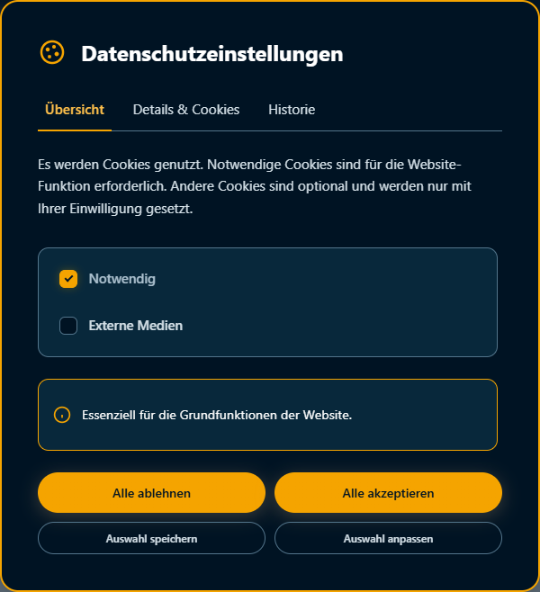
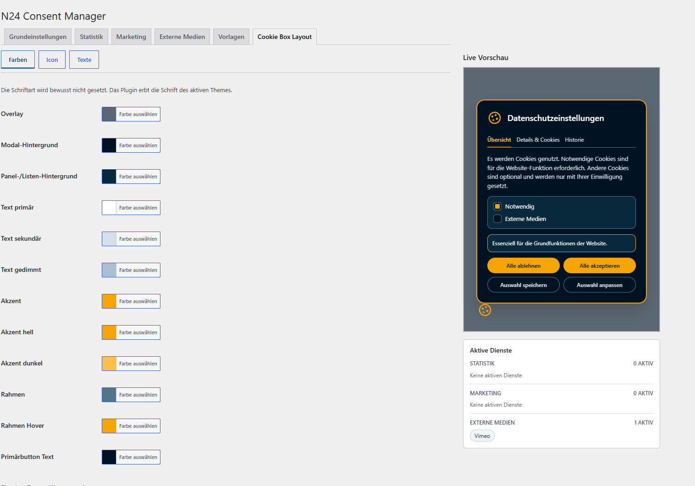
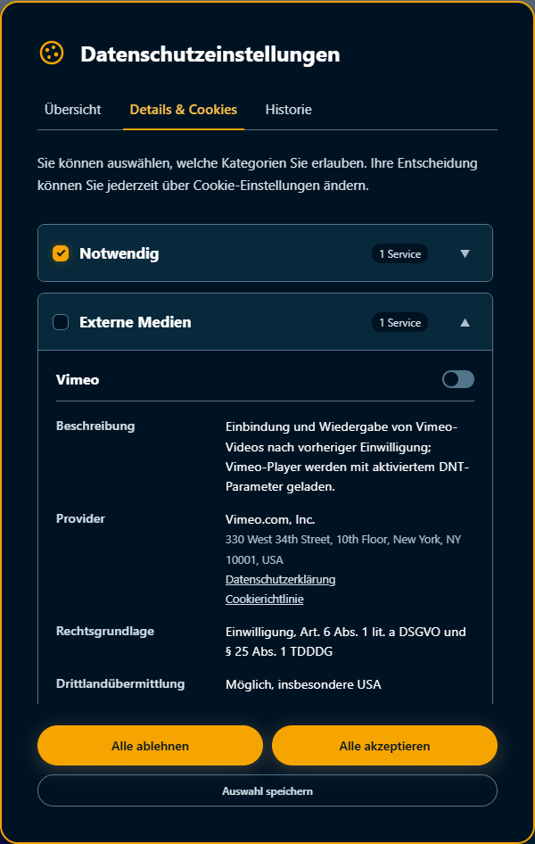
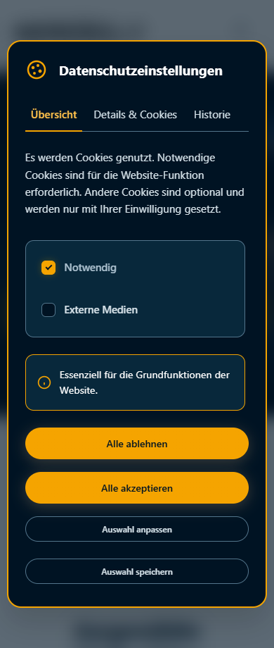

# N24 Consent Manager

**Einwilligungen, Cookie-Informationen und externe Medien direkt in WordPress verwalten.**

Der N24 Consent Manager bietet einen anpassbaren Consent-Dialog mit Kategorien, einzelnen Diensten und einer Einwilligungshistorie. Farben, Texte und Icons lassen sich im WordPress-Backend gestalten – mit Live-Vorschau und ohne eine zusätzliche Schriftart zu laden.

[Installation](#installation) · [Einrichtung](#einrichtung) · [Funktionen](#funktionen) · [Screenshots](#screenshots) · [Häufige Fragen](#häufige-fragen)

<p align="center">
  
</p>

> Die Screenshots zeigen eine lokale Beispielkonfiguration in Dunkelblau und Gold. Farben, Texte und verfügbare Dienste richten sich nach den Einstellungen der jeweiligen Website.

## Funktionen

| Funktion | Was sie ermöglicht |
| --- | --- |
| **Kategorien und einzelne Dienste** | Notwendige Funktionen, Statistik, Marketing und externe Medien getrennt anzeigen und optionale Dienste gezielt auswählen. |
| **Mehrere Auswahlmöglichkeiten** | Alle optionalen Dienste ablehnen, alle akzeptieren oder eine individuelle Auswahl speichern. |
| **Details & Cookies** | Anbieter, Zweck, Datenschutzlinks und Cookie-Angaben der konfigurierten Dienste einsehen. |
| **Externe Medien** | Unterstützte Einbettungen, beispielsweise YouTube, Vimeo und Google Maps, hinter einem Inhaltshinweis anzeigen und nach Freigabe laden. |
| **Dienstvorlagen** | Vorlagen unter anderem für Google Analytics 4, Matomo, Google Ads, Meta Pixel und externe Medien übernehmen und an die eigene Website anpassen. |
| **Live-Vorschau** | Farben, Texte und Icons der Cookie-Box direkt beim Bearbeiten beurteilen. |
| **Eigenes Erscheinungsbild** | Hintergründe, Text-, Akzent-, Rahmen- und Buttonfarben sowie separate Icons für Dialog und schwebenden Button einstellen. Die Schrift wird vom Theme übernommen. |
| **Transparenter Cookie-Button** | Hintergrund und Hover-Hintergrund des schwebenden Buttons unabhängig voneinander transparent einstellen. |
| **Erneut öffnen und ändern** | Den Dialog jederzeit über den schwebenden Button oder einen Shortcode-Link öffnen. |
| **Historie und Versionen** | Gespeicherte Entscheidungen im Browser anzeigen und bei geänderter Banner- oder Datenschutzversion erneut eine Auswahl anfordern. |
| **Nur-notwendig-Modus** | Ohne optionale Dienste Cookie-Informationen auf Abruf anbieten, ohne automatisch einen Einwilligungsdialog einzublenden. |

Die Oberfläche ist standardmäßig deutsch. Eine englische Übersetzung liegt im Verzeichnis `languages/` bei. Der Dialog passt sich an kleinere Bildschirme an und unterstützt Tastaturbedienung sowie die Systemeinstellung für reduzierte Bewegung.

## Screenshots

### Einstellungen mit Live-Vorschau

Unter **Cookie Box Layout** werden Farben, Icons und Texte bearbeitet. Die Vorschau zeigt das gewählte Erscheinungsbild und die verfügbaren Kategorien.



### Dienste im Detail

Im Reiter **Details & Cookies** können Besucher die konfigurierten Dienste prüfen und einzeln auswählen.

<p align="center">
  
</p>

### Mobile Ansicht

Der Dialog ordnet die Schaltflächen auf kleinen Displays untereinander an. Längere Inhalte lassen sich innerhalb des Dialogs scrollen.

<p align="center">
  
</p>

<details>
<summary>Transparenz-Einstellungen ansehen</summary>

Hintergrund und Hover-Hintergrund besitzen jeweils einen eigenen **Transparent**-Schalter.


</details>

## Installation

Du benötigst eine WordPress-Installation und die Berechtigung, Plugins zu installieren.

### Über das WordPress-Backend

1. Lade den Quellcode über **Code → Download ZIP** in diesem Repository herunter.
2. Entpacke das GitHub-Archiv. Benenne den enthaltenen Plugin-Ordner gegebenenfalls von `n24-consent-manager-main` in **`n24-consent-manager`** um.
3. Erstelle eine ZIP-Datei dieses Ordners. Die Datei `n24-consent-manager.php` muss darin unter `n24-consent-manager/n24-consent-manager.php` liegen.
4. Öffne in WordPress **Plugins → Installieren → Plugin hochladen**, wähle die ZIP-Datei und klicke auf **Jetzt installieren**.
5. Aktiviere **N24 Consent Manager**.
6. Öffne **Einstellungen → N24 Consent Manager** und richte das Plugin wie unten beschrieben ein.

Hast du bereits ein installierbares ZIP mit der genannten Ordnerstruktur, kannst du direkt bei Schritt 4 beginnen.

### Per SFTP oder Dateimanager

Lade den entpackten Ordner nach `wp-content/plugins/n24-consent-manager/` hoch und aktiviere das Plugin anschließend in WordPress unter **Plugins**.

### Eine vorhandene Installation aktualisieren

Sichere vor dem Update Plugin-Dateien und Datenbank. Lade dann das neue Plugin-ZIP hoch und bestätige in WordPress das Ersetzen der bestehenden Version. Verwende denselben Ordnernamen, damit keine zweite Plugin-Kopie entsteht. Die Konfiguration wird in der WordPress-Datenbank gespeichert.

## Einrichtung

### 1. Grundeinstellungen hinterlegen

Öffne **Einstellungen → N24 Consent Manager → Grundeinstellungen**. Prüfe den Aktivierungsstatus, die Anbieterangaben sowie die Links zu Datenschutz und Impressum. Verwende die tatsächlichen URLs deiner Website.

### 2. Dienste auswählen und konfigurieren

Unter **Vorlagen** kannst du passende Dienste hinzufügen. Eine hinzugefügte Vorlage ist zunächst inaktiv. Prüfe anschließend im jeweiligen Reiter **Statistik**, **Marketing** oder **Externe Medien** die Anbieter-, Zweck-, Cookie- und Datenschutzangaben.

Ergänze die für deinen Dienst erforderlichen IDs beziehungsweise Einbindungscodes, aktiviere den Dienst und speichere die Einstellungen. Vorlagen sind Ausgangspunkte; sie müssen zur tatsächlichen Einbindung deiner Website passen.

**Die Einbindung gehört zur Einrichtung:** Ein separat im Theme, in einem anderen Plugin oder in einem Tag-Manager geladenes Skript wird nicht allein dadurch blockiert, dass sein Name im Consent-Dialog steht. Binde optionale Skripte über die vorgesehenen Dienstfelder ein und aktiviere die passenden Inhaltssperren für unterstützte externe Medien. Prüfe das Verhalten auf der fertigen Seite.

### 3. Design anpassen

Unter **Cookie Box Layout** findest du die Bereiche **Farben**, **Icon** und **Texte**. Passe die Darstellung an deine Website an und kontrolliere das Ergebnis in der Live-Vorschau.

Für einen Cookie-Button ohne Hintergrund aktiviere im Bereich **Farben** jeweils **Transparent** bei **Floating-Button Hintergrund** und **Floating-Button Hover**. Beide Zustände sind getrennt einstellbar. Speichere anschließend die Einstellungen.

### 4. Cookie-Einstellungen im Footer verlinken

Der schwebende Cookie-Button wird automatisch ausgegeben. Für einen zusätzlichen Link, zum Beispiel im Footer, füge diesen Shortcode in einen WordPress-Shortcode-Block ein:

```text
[n24_consent_settings]
```

Er öffnet den Dialog erneut, damit Besucher ihre Auswahl ändern können. Ohne optionale Dienste öffnet er die Cookie-Informationen.

### 5. Darstellung und Freigaben prüfen

Öffne die Website in einem privaten Browserfenster. Prüfe die Anzeige auf Desktop und Smartphone sowie **Alle ablehnen**, **Alle akzeptieren** und eine individuelle Auswahl. Kontrolliere auch, dass externe Medien erst nach der jeweiligen Freigabe laden und die Einstellungen erneut geöffnet werden können.

## Verhalten ohne optionale Dienste

Wenn keine optionalen Statistik-, Marketing- oder Mediendienste verfügbar sind, wechselt das Plugin automatisch in den **Nur-notwendig-Modus**.

- Es öffnet sich beim Seitenaufruf kein automatischer Banner.
- Der Consent Manager legt keine Auswahl im Local Storage, kein Consent-Cookie und keine Consent-ID an.
- Es werden keine Einwilligungshistorie und keine neuen serverseitigen Einwilligungsprotokolle erzeugt.
- Der schwebende Button und der Shortcode-Link öffnen die Cookie-Informationen.

Sobald optionale Dienste verfügbar sind, steht der vollständige Consent-Dialog mit Auswahlmöglichkeiten bereit.

## Häufige Fragen

### Warum sehe ich beim ersten Besuch keinen Banner?

Prüfe, ob das Plugin aktiviert ist und optionale Dienste eingerichtet sind. Im Nur-notwendig-Modus wird bewusst kein automatischer Banner angezeigt. Auch eine noch gültige gespeicherte Auswahl kann verhindern, dass der Dialog erneut erscheint; über den Cookie-Button lässt er sich öffnen.

### Kann ich nur einen bestimmten Mediendienst freigeben?

Ja. In der Detailansicht lassen sich Dienste einzeln auswählen. Bei unterstützten blockierten Einbettungen speichert **Immer laden** die Freigabe für den zugeordneten Dienst. Die übrigen Dienste werden dadurch nicht automatisch freigegeben.

### Wie lange gilt eine gespeicherte Auswahl?

Eine gespeicherte Einwilligung ist technisch auf ein Jahr begrenzt. Ändert sich die konfigurierte Banner- oder Datenschutzversion, wird eine neue Entscheidung angefordert. Besucher können ihre Auswahl auch vorher über den Cookie-Button ändern.

### Was muss beim Umzug auf die Online-Website mit?

Übertrage neben den Plugin-Dateien auch die WordPress-Datenbank beziehungsweise die Plugin-Einstellungen. GitHub enthält den Code, aber keine websitebezogenen Farben, Dienstkonfigurationen oder Anbieterangaben. Prüfe nach dem Umzug insbesondere Datenschutz- und Impressumslinks sowie die aktivierten Dienste.

### Ist die Website damit automatisch rechtlich geprüft?

Nein. Das Plugin stellt technische Funktionen bereit. Dienste, Texte und tatsächliche Einbindungen müssen zur Website passen. Der [technische Datenschutz-Baustein](DATENSCHUTZ-BAUSTEIN.md) beschreibt ausschließlich den Nur-notwendig-Modus und ersetzt keine individuelle Prüfung.

## Weitere Dokumentation

- [Änderungsverlauf](CHANGELOG.md)
- [Entwicklung, Erweiterungen und Tests](docs/ENTWICKLUNG.md)
- [Technischer Datenschutz-Baustein für den Nur-notwendig-Modus](DATENSCHUTZ-BAUSTEIN.md)

Fragen und reproduzierbare Probleme können über die [GitHub Issues](https://github.com/Nerdies-Webdevelopment/n24-consent-manager/issues) gemeldet werden.
